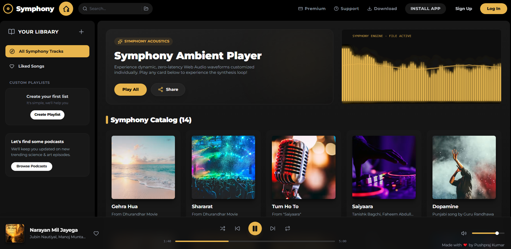

# 🎵 Symphony Music App

A modern and responsive music streaming web application built with React, TypeScript, and Vite.

## 🌐 Live Demo

[🎵 Open Symphony App](https://pushprajkumar640-lang.github.io/symphony-app/)

## 📸 Screenshot



## ✨ Features

- 🎵 Play, Pause, Next & Previous Songs
- ❤️ Trending, Popular & Devotional Songs
- 🖼️ Custom Album Cover Images
- 🔊 Volume Control
- 📱 Responsive Design
- ⚡ Fast Performance

## 🛠️ Tech Stack

- React
- TypeScript
- Vite
- CSS
- GitHub Pages

  ## 📁 Project Structure

```
symphony/
├── public/
│   ├── images/
│   └── songs/
├── src/
│   ├── components/
│   ├── data/
│   │   └── songs.ts
│   ├── utils/
│   ├── App.tsx
│   ├── main.tsx
│   └── types.ts
├── package.json
├── vite.config.ts
└── README.md
```

## 📦 Installation

```bash
git clone https://github.com/pushprajkumar640-lang/symphony-app.git
cd symphony-app
npm install
npm run dev
```

## 👨‍💻 Author

**Pushpraj Kumar**

